# STEEL QUOTE MANAGEMENT SYSTEM

A responsive steel quotation management system designed for a steel fabrication and engineering business using ASP.NET Core MVC (.NET 8), Entity Framework Core, SQL Server, ViewModels, and a service-layer architecture.

The application can be accessed from any device with a modern web browser and provides quote, quote line, and manufacturing process management, automated pricing calculations, soft deletes, lookup-based statuses, reporting, quote previews, validation, and a mobile-friendly user interface.

---

## FEATURES

## Quote Management

-	Create, edit and delete customer quotations
-	Automatically generate internal quote numbers
-	Quote status management
-	Quote preview for customer presentation

---

## Quote Lines

Add multiple line items to a quotation:
-   Item description
-   Quantity
-   Material grade
-   Dimensions
-   Mass
-   Unit pricing

---

## Manufacturing Processes

Each quote line can contain multiple manufacturing processes such as:
-	Laser Cutting
-	Plasma Cutting
-	Drilling
-	Bending
-	Rolling
-	Welding
    -   Process costs are automatically included in the line total.

---

## Automatic Calculations

The application automatically calculates:

-   Mass Each (Kg)
    -   Based on Volume(Length * Width * Thickness) and steel density.
-   Price Each
    -   Based on Mass Each (Kg), Price per Kg, and Processing cost.
-	Processing Cost
    -   Sum of processing cost.
-	Line Price Total
-	Quote Total

---

## Reporting

-	Quote Register with filters
-	Quote Preview

---

<!-- ## Screenshots
### Quote Maintenance
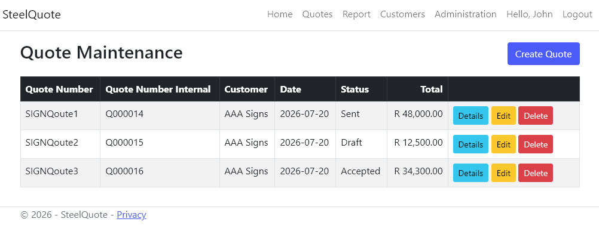
### Quote Details
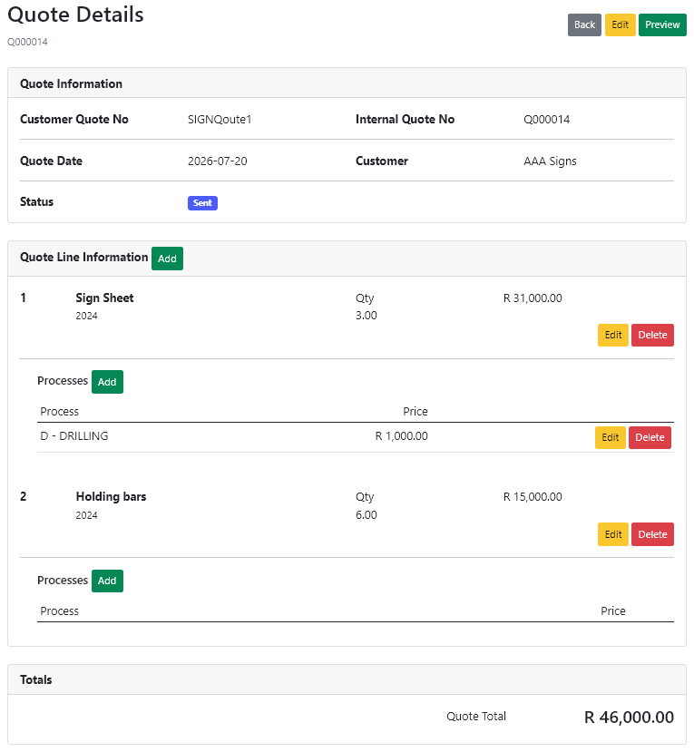
### Quote Preview
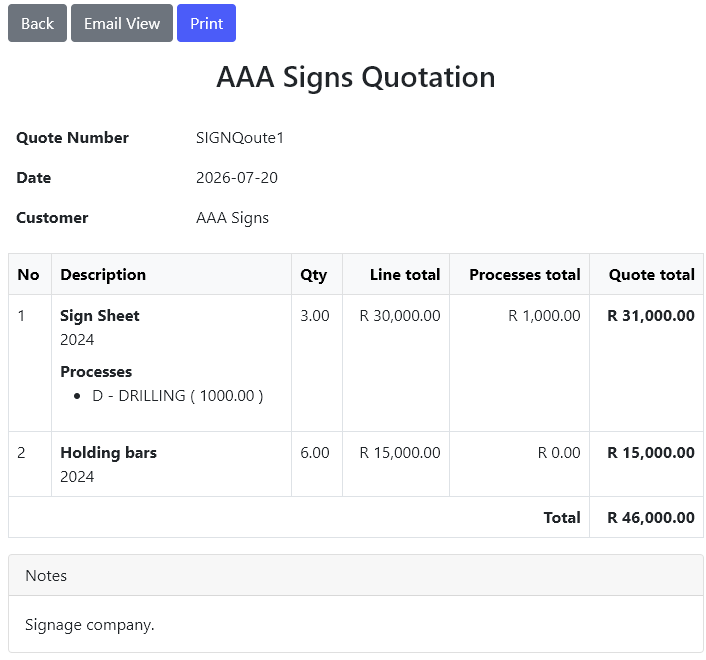
### Create Quote
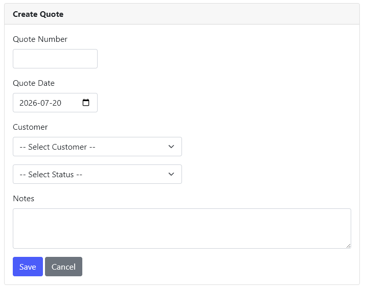
### Add Quote Line
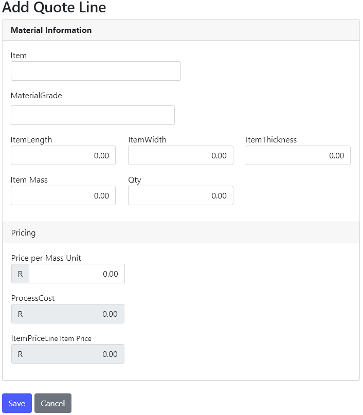
### Add Process
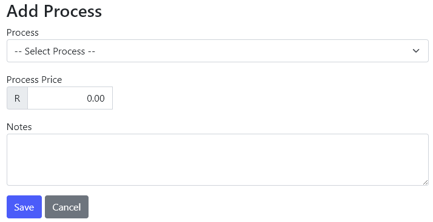
### Quote Register
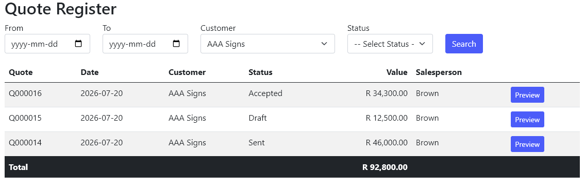 -->

## Screenshots

### Quote Maintenance (Desktop/Tablet)
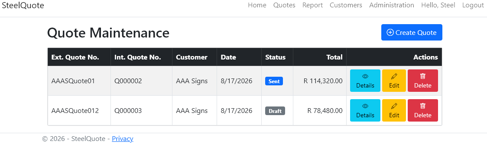

### Quote Maintenance (Mobile)
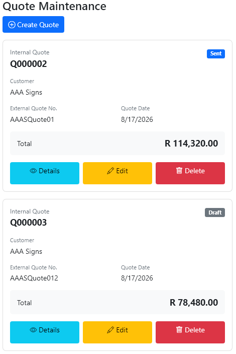

---

### Quote Details (Desktop/Tablet)
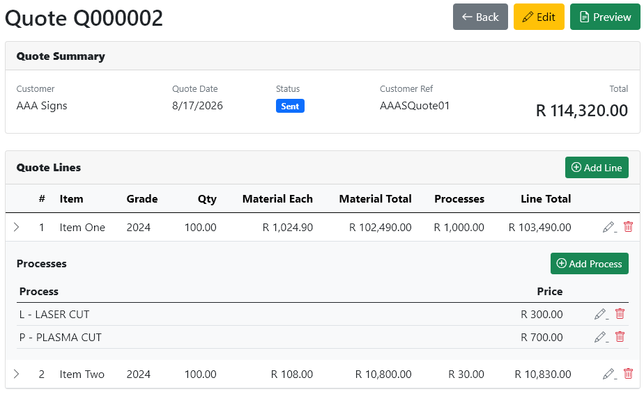

### Quote Details (Mobile)
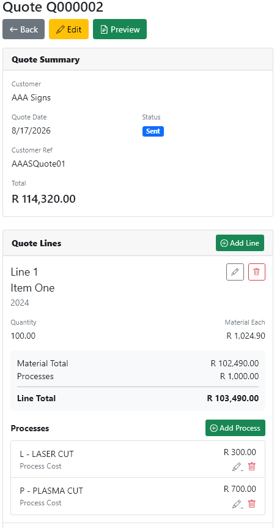

---

### Quote Preview (Desktop/Tablet)
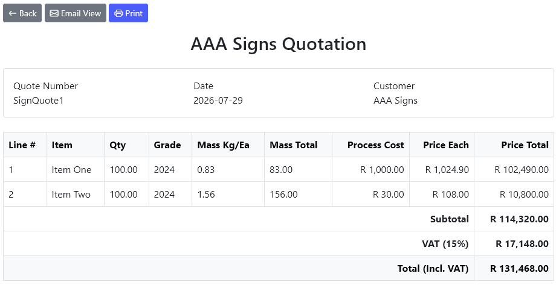

### Quote Preview (Mobile)
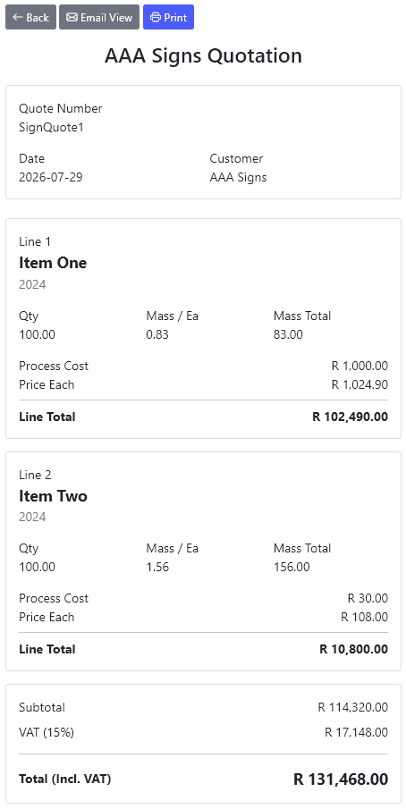

---

### Create Quote (Desktop/Tablet)

---

### Add/Edit Quote Line (Desktop/Tablet)
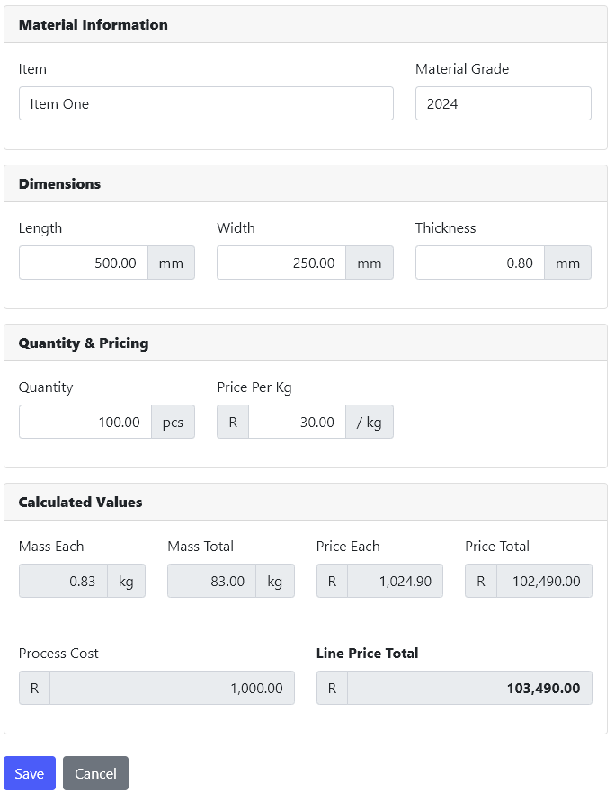

---

### Add/Edit Process (Desktop/Tablet)
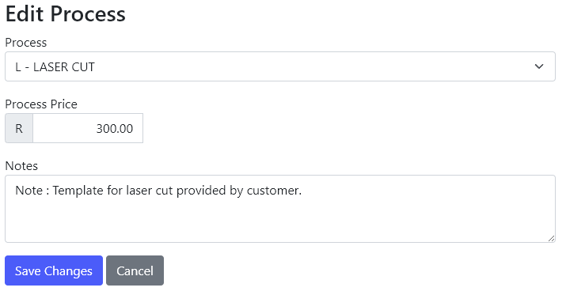

---

### Quote Register (Desktop/Tablet)
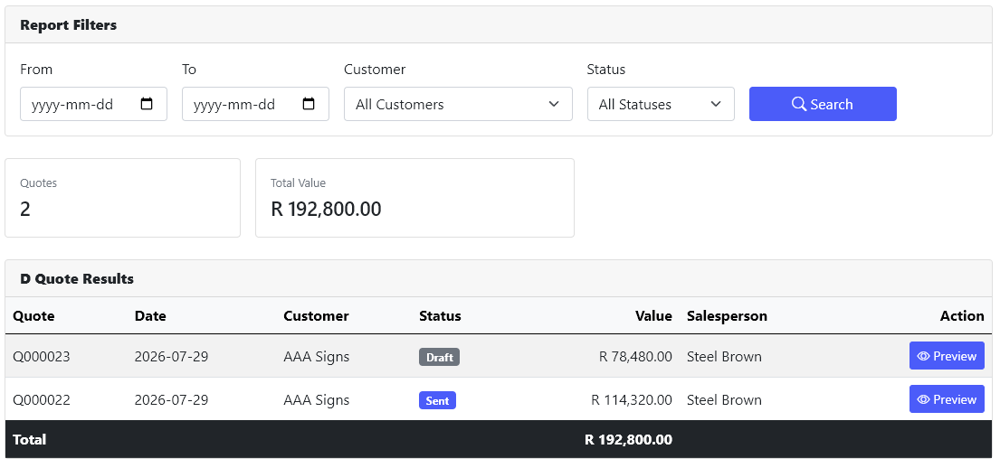

### Quote Register (Mobile)
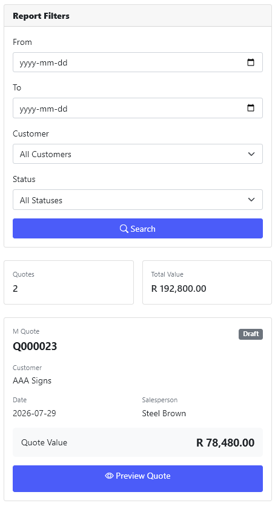

<!-- ## Screenshots
### Quote Maintenance

### Quote Details

### Quote Preview

### Create Quote

### Add Quote Line

### Add Process

### Quote Register
 -->

---

## Future Enhancements
Planned functionality includes:
-	Product Catalogue
-	Material Pricing
-	PDF Quote Generation
-	Email PDF Quotes
-	Quote Revision History
-	Sales Order Conversion
-	Inventory Integration
-	Dashboard & KPI Reporting

---

## Technologies

-	ASP.NET Core MVC (.NET 8)
-	Entity Framework Core
-	SQL Server
-	Bootstrap 5
-	LINQ
-	Dependency Injection
-	Razor Views

### Link
[Architecture Documentation](docs/architecture.md)

## License

MIT License
